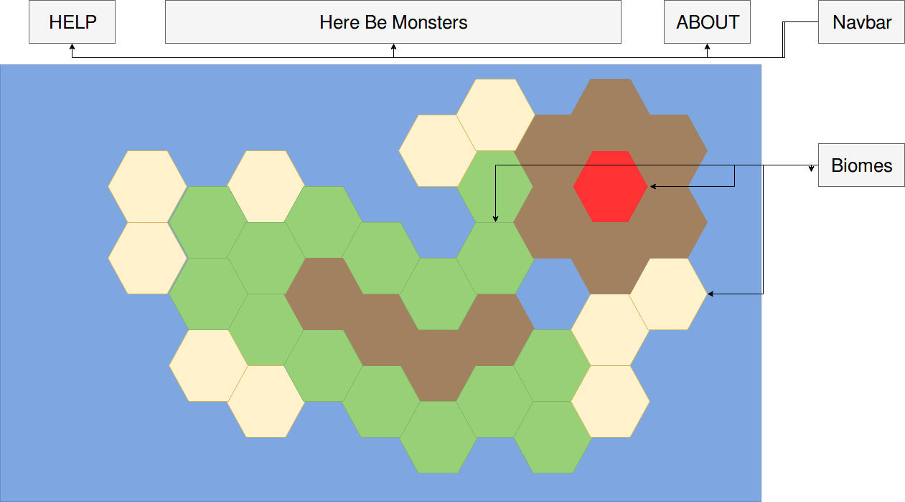

# Here Be Monsters
This project tentatively known as "Here Be Monsters" is an interactive map filled with data concerning various indigenous monsters. It is going to be powered by SheetJS, canvas, and vanilla JavaScript. The main interface will be built of a canvas element covered in different colors corresponding to different "biomes" that the various monsters will inhabit. Upon clicking one of the regions, the user will be presented with thumbnail portraits of the various monsters that are associated with that particular region. Further hovering or clicking will bring up a final short textual description for this monster.

The individual monsters data will be stored on a spreadsheet kept on Googles servers. Part of the project will be to access this spreadsheet and read the data within. SheetJS provides numerous utility methods for both reading and writing data to externally stored spreadsheets, with many of it resembling SQL methods.

A possible issue for this project(that can be discussed in person) is the possible copyright issues associated with using creatures from a known property(Dungeons and Dragons). If I keep my monsters to free-use and folk-lore inspired there should be little issue from what I can see.

## Features and MVPS
Here Be Monsters will have 3 core features:
- [ ] Respond to user clicking with correct actions
- [ ] Visually display stored data in a stimulating manner
- [ ] Allow for easy extendability and modularity(Object Orientated)

If time permits I would also like to implement these 2 bonus features:
- [ ] A simple form for changing the data stored in the spreadsheet
- [ ] Connect this fully functional component to my flex project, combining their shared concept and underlying similarity in data structure and model associations to have a single technically and visually impressive project.

Finally the project will have these small visual features, these are necessary but not major features:
- [ ] A Help modal
- [ ] An about modal

## WireFrames
The project will consist of a single page simulated canvas with splotches of color representing colored areas. It is my hope that these colors will resemble an island or small continent, though how much geographic detail I can fit in remains to be seen.

## Technologies

SheetJS is a simple to use framework that can import and export "worksheets" which are json objects, that can be created by giving an array of arrays(representations of a normal spreadsheet) to a specific importing method available to SheetJS. This gives you an easy to use and light weight database-esque storage system.

## Timeline

I would like to discuss the further day planning, I have a vague idea of what I want done on each day but I don't know if those are reasonable guides.

### Weekend
- [x] Acquire seeded spreadsheet with relevant information
- [x] Work through SheetJS tutorial

### Day 1
Setup node backend, webpack, and canvas. Create basic biome class.
- [ ] Node Backend
- [ ] Webpack Serving files
- [ ] Canvas display basic Shape
- [ ] Biome Class
### Day 2
Create basic monster class, select featured monsters. Get json request set up. Add basic event listeners for canvas shapes.
- [ ] Unsure
### Day 3
Finish different visual classes linking to logical classes. Add styled models for Help and About
- [ ] Unsure
### Day 4
Finish any remaining CSS, work on possible bonus features
- [ ] Unsure
